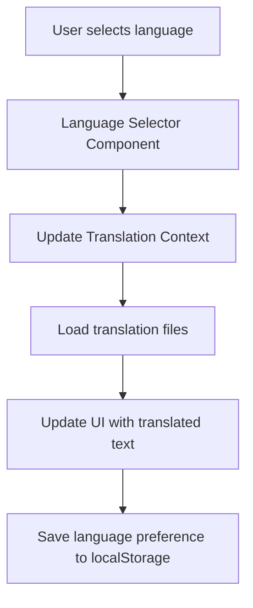

# Translation Architecture Plan

## Overall Approach

Implement a consistent translation system across all UI components with a language selector positioned in the top right corner of each page.

## Architecture Components

### 1. Translation Context/Provider (React Applications)
- Create a TranslationContext to manage the current language and translations
- Implement a TranslationProvider component to wrap the application
- Store translations in JSON files for each language (en, tr)

### 2. Language Selector Component
- Position in the top right corner of all pages
- Dropdown menu with available languages
- Persistent language selection using localStorage
- Consistent design across all applications

### 3. Translation Hook/Function
- Custom hook `useTranslation` for React components
- Function `t(key)` to retrieve translated strings
- Support for parameterized translations

### 4. Translation Files Structure
```
src/
  locales/
    en/
      common.json
      dashboard.json
      ...
    tr/
      common.json
      dashboard.json
      ...
```

## Implementation for Different UI Types

### React Applications
- Use context API for state management
- Create HOC or custom hook for translation
- Wrap each application with TranslationProvider

### HTML Templates
- Implement translation with JavaScript functions
- Load translations based on selected language
- Replace text content dynamically

### JavaScript Files
- Create translation utility functions
- Load translations asynchronously
- Replace text in UI elements

## Language Selector Design

### Position
- Fixed position in top right corner
- Visible on all pages and components
- Z-index to ensure it's always on top

### Features
- Flag icons or language names
- Current language indicator
- Smooth dropdown animation
- Responsive design for mobile

### Implementation
```jsx
// React component example
<LanguageSelector 
  languages={[{code: 'en', name: 'English'}, {code: 'tr', name: 'Türkçe'}]}
  currentLanguage="tr"
  onLanguageChange={(langCode) => handleLanguageChange(langCode)}
/>
```

## Data Flow



## Consistency Across Applications

1. Shared translation files where possible
2. Consistent language selector design
3. Unified translation keys naming convention
4. Centralized language management